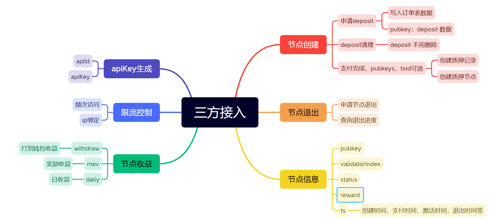

# 三方API接口



<!-- TOC -->
* [三方API接口](#三方api接口)
  * [APIKey生成](#apikey生成)
    * [签名算法](#签名算法)
  * [限流控制](#限流控制)
  * [节点创建](#节点创建)
    * [申请deposit文件](#申请deposit文件)
    * [支付完成反馈](#支付完成反馈)
  * [节点退出](#节点退出)
    * [申请节点退出](#申请节点退出)
    * [查询节点退出状态](#查询节点退出状态)
  * [节点信息](#节点信息)
    * [查询单个节点](#查询单个节点)
    * [查询多个节点](#查询多个节点)
    * [查询所有节点(分页)](#查询所有节点分页)
  * [节点收益](#节点收益)
    * [withdraw收益](#withdraw收益)
    * [质押收益](#质押收益)
    * [mev收益](#mev收益)
<!-- TOC -->

## APIKey生成

apikey生成是在平台生成的，不对外提供接口
可以把生成apikey所需要的信息提交过来

### 签名算法

拟定的一个，还需要修改
* 请求的header需要3个参数Api-Id,Api-Ts,Api-Sign
* Api-Id 是颁发的id,
* Api-Ts 代表当前UTC 时间戳， ts的有效期为1800s
* Api-Sign 验签的签名串
* 签名算法是请求body序列化后，然后进行字符排序，然后拼接Api-Id,Api-Ts,secret. secret 是Api-Id一起颁发的密钥，注意保密
* 将上述拼接的字符串，用md5加密算法进行签名
* 加密过程参考ApiSignUtil

1. 举例1, 实际参数如下
请求header:
```shell
Api-Id: c1
Api-Ts: 1685346885
Api-Sign: 46d2d7ccd318f307a9b62d9e72287541
```
请求body
```json
{
  "num": 1,
  "rewardAddress": "0x555d46a4670b380473e5aedbac41487b2aadc050"
}
```

## 限流控制

针对接口限流

针对IP限流

IP白名单设置

## 节点创建

### 申请deposit文件

接口 `POST /v1/api/eth/node/init/create`

请求参数

```json
{
  "num": 2,
  "rewardAddress": "0x725b5f77496182ffdf67df1fa84cbb5f6111c2b4"
}
```

响应数据

```json
{
  "code": 200,
  "message": "",
  "data": {
    "deposits": [
      {
        "deposit": "",
        "pubKey": "0xa9f4ef8b278e9a72b42ae52b6287b8ea271f14457c63b5cce4da4dab4f02a984f20cd3402028a44107fb91606c092372"
      },
      {
        "deposit": "",
        "pubKey": "0x8eafeea384b111f90b80a733d6c713022d54ec4a612d000383c1775b804fb603485656f790bb679c5f6e8ecf848b3453"
      }
    ]
  }
}
```

## 节点退出

### 申请节点退出

接口 `POST /v1/api/eth/node/exit/apply`

请求参数

```json
{
  "pubKey": "0x8eafeea384b111f90b80a733d6c713022d54ec4a612d000383c1775b804fb603485656f790bb679c5f6e8ecf848b3453",
  "ts": 1682393064,
  "signature": "0xeea1795228e7ccbca3c9e3ac1eed37e73895a76123dfc837b24dcca4d97aea2e34a94d7926882a77ac7fd67589857e17a3584fc22a453ad1fae10fe52b439e011c"
}
```
| 列            | 说明             |
|--------------|----------------|
| pubKey       | 节点公钥           |
| ts           | 收益数量           |
| signature    | 签名，钱包私钥对ts做的签名 |

响应数据

```json
{
  "code": 200,
  "message": "",
  "data": ""
}
```

### 查询节点退出状态

接口 `POST /v1/api/eth/node/exit/status`

请求参数

```json
{
  "pubKey": "0x8eafeea384b111f90b80a733d6c713022d54ec4a612d000383c1775b804fb603485656f790bb679c5f6e8ecf848b3453"
}
```

响应数据

```json
{
  "code": 200,
  "message": "",
  "data": {
    "pubKey": "0x8eafeea384b111f90b80a733d6c713022d54ec4a612d000383c1775b804fb603485656f790bb679c5f6e8ecf848b3453",
    "exitStatus": 5,
    "exitStatusMsg": "WITHDRAW",
    "updateTime": 1682393064
  }  
}
```

## 节点信息

### 查询单个节点

接口 `POST /v1/api/eth/node/detail/one`

请求参数

```json
{
  "pubKey": "0x8eafeea384b111f90b80a733d6c713022d54ec4a612d000383c1775b804fb603485656f790bb679c5f6e8ecf848b3453"
}
```

返回数据

```json
{
  "code": 200,
  "message": "",
  "data": {
    "pubKey": "公钥",
    "validatorIndex": 123456,
    "payAddress": "支付地址",
    "rewardAddress": "收益地址",
    "status": 4,
    "exitStatus": 0,
    "statusMsg": "ACTIVE",
    "balanceNum": 32.123456,
    "rewardNum": 0.765432,
    "rewardStakeNum": 0.665432,
    "rewardMevNum": 0.1,
    "weekRewardNum": 0.064532,
    "weekRewardStakeNum": 0.064532,
    "weekRewardMevNum": 0.0,
    "totalWithdrawals": 0.612345,
    "payAt": 1682393064,
    "activeAt": 1682393064,
    "exitingAt": 0,
    "exitedAt": 0,
    "withdrawAt": 0,
    "actualWithdrawAt": 0
  }
}
```


| 列                  | 说明        |
|--------------------|-----------|
| balanceNum         | 余额数量      |
| rewardNum          | 收益数量      |
| rewardStakeNum     | 质押收益数量    |
| rewardMevNum       | mev收益数量   |
| weekRewardNum      | 七天收益数量    |
| weekRewardStakeNum | 七天质押收益数量  |
| weekRewardMevNum   | 七天MEV收益数量 |
| totalWithdrawals   | 提取到收益钱包数量 |
| payAt              | 支付时间      |
| activeAt           | 激活时间      |
| exitingAt          | 退出中时间     |
| exitedAt           | 已退出时间     |
| withdrawAt         | 本金到账时间    |
| actualWithdrawAt   | 本金实际到账时间  |

### 查询多个节点

接口 `POST /v1/api/eth/node/detail/many`

请求参数

```json
{
  "pubKeys": ["0x8eafeea384b111f90b80a733d6c713022d54ec4a612d000383c1775b804fb603485656f790bb679c5f6e8ecf848b3453"]
}
```

| 参数      | 说明       |
|---------|----------|
| pubKeys | 最大支持100个 |

响应数据

```json
{
  "code": 200,
  "message": "",
  "data": [{
    "pubKey": "公钥",
    "validatorIndex": 123456,
    "payAddress": "支付地址",
    "rewardAddress": "收益地址",
    "status": 4,
    "exitStatus": 0,
    "statusMsg": "ACTIVE",
    "balanceNum": 32.123456,
    "rewardNum": 0.765432,
    "rewardStakeNum": 0.665432,
    "rewardMevNum": 0.1,
    "weekRewardNum": 0.064532,
    "weekRewardStakeNum": 0.064532,
    "weekRewardMevNum": 0.0,
    "totalWithdrawals": 0.612345,
    "payAt": 1682393064,
    "activeAt": 1682393064,
    "exitingAt": 0,
    "exitedAt": 0,
    "withdrawAt": 0,
    "actualWithdrawAt": 0
  }
  ]
}
```

| 列                  | 说明        |
|--------------------|-----------|
| balanceNum         | 余额数量      |
| rewardNum          | 收益数量      |
| rewardStakeNum     | 质押收益数量    |
| rewardMevNum       | mev收益数量   |
| weekRewardNum      | 七天收益数量    |
| weekRewardStakeNum | 七天质押收益数量  |
| weekRewardMevNum   | 七天MEV收益数量 |
| totalWithdrawals   | 提取到收益钱包数量 |
| payAt              | 支付时间      |
| activeAt           | 激活时间      |
| exitingAt          | 退出中时间     |
| exitedAt           | 已退出时间     |
| withdrawAt         | 本金到账时间    |
| actualWithdrawAt   | 本金实际到账时间  |

### 查询所有节点(分页)

接口 `POST /v1/api/eth/node/detail/all`

请求参数

```json
{
  "pageNum": 1,
  "pageSize": 10
}
```

| 参数       | 说明         |
|----------|------------|
| pageNum  | 当前页        |
| pageSize | 每页数量，最大100 |

响应数据

```json
{
  "code": 200,
  "message": "",
  "data": {
    "pageNum": 1,
    "pageSize": 10,
    "totalCount": 95,
    "totalPage": 10,
    "data": [
      {
        "pubKey": "公钥",
        "validatorIndex": 123456,
        "payAddress": "支付地址",
        "rewardAddress": "收益地址",
        "status": 4,
        "exitStatus": 0,
        "statusMsg": "ACTIVE",
        "balanceNum": 32.123456,
        "rewardNum": 0.765432,
        "rewardStakeNum": 0.665432,
        "rewardMevNum": 0.1,
        "weekRewardNum": 0.064532,
        "weekRewardStakeNum": 0.064532,
        "weekRewardMevNum": 0.0,
        "totalWithdrawals": 0.612345,
        "payAt": 1682393064,
        "activeAt": 1682393064,
        "exitingAt": 0,
        "exitedAt": 0,
        "withdrawAt": 0,
        "actualWithdrawAt": 0
      }
    ]
  }
}
```

## 节点收益

### withdraw收益

打到钱包的收益
接口 `POST /v1/api/eth/node/reward/withdraw`

请求参数

```json
{
  "pubKeys": ["0x8eafeea384b111f90b80a733d6c713022d54ec4a612d000383c1775b804fb603485656f790bb679c5f6e8ecf848b3453"],
  "startAt": 1682100000,
  "endAt": 1682393064,
  "pageNum": 1,
  "pageSize": 10
}
```


| 参数       | 说明               |
|----------|------------------|
| pubKeys  | 可选参数，没有就不传递      |
| startAt  | 可选参数，没有不限制       |
| endAt    | 可选参数，必须大于startAt |
| pageNum  | 当前页              |
| pageSize | 每页数量，最大100       |

响应数据

```json
{
  "code": 200,
  "message": "",
  "data": {
    "pageNum": 1,
    "pageSize": 10,
    "totalCount": 995,
    "totalPage": 100,
    "data": [
      {
        "pubKey": "公钥",
        "validatorIndex": 123456,
        "rewardAddress": "收益地址",
        "block": 123456,
        "slot": 123456,
        "blockRoot": "",
        "withdrawalIndex": 123456,
        "amount": 0.123456,
        "status": 0,
        "createdAt": 1682393064
      }
    ]
  }
}
```

按照createdAt创建时间进行倒叙排列，理论上一天一条数据

| 列      | 说明             |
|--------|----------------|
| amount | 收益数量           |
| status | 0 默认值, 1 退款32个 |

### 质押收益

接口 `POST /v1/api/eth/node/reward/stake`

请求参数

```json
{
  "pubKeys": ["0x8eafeea384b111f90b80a733d6c713022d54ec4a612d000383c1775b804fb603485656f790bb679c5f6e8ecf848b3453"],
  "startAt": 1682100000,
  "endAt": 1682393064,
  "pageNum": 1,
  "pageSize": 10
}
```

响应数据

```json
{
  "code": 200,
  "message": "",
  "data": {
    "pageNum": 1,
    "pageSize": 10,
    "totalCount": 95,
    "totalPage": 10,
    "data": [
      {
        "pubKey": "公钥",
        "validatorIndex": 123456,
        "amount": 0.123456,
        "day": 365,
        "startTs": 1682300000,
        "endTs": 1682393064,
        "startBalance": 32.0123,
        "endBalance": 32.0234,
        "createdAt": 1682393064
      }
    ]
  }
}
```

### mev收益

接口 `POST /v1/api/eth/node/reward/mev`

```json
{
  "pubKeys": ["0x8eafeea384b111f90b80a733d6c713022d54ec4a612d000383c1775b804fb603485656f790bb679c5f6e8ecf848b3453"],
  "startAt": 1682100000,
  "endAt": 1682393064,
  "pageNum": 1,
  "pageSize": 10
}
```

响应数据

```json
{
  "code": 200,
  "message": "",
  "data": {
    "pageNum": 1,
    "pageSize": 10,
    "totalCount": 95,
    "totalPage": 10,
    "data": [
      {
        "pubKey": "公钥",
        "validatorIndex": 123456,
        "rewardAddress": "收益地址",
        "amount": 0.512345,
        "ts": 1682392154,
        "createdAt": 1682393064
      }
    ]
  }
}
```

## 平台
### 收益率查询

接口 `POST /v1/api/eth/apr/organ`
* 获取平台相关收益率

请求参数，无

响应数据
```json
{
  "code": 200,
  "data": {
    "apr": "3.43",
    "mevApr": "2.02",
    "ts": 1695028092
  },
  "message": "请求成功",
  "success": true
}
```
| 列      | 说明     |
|--------|--------|
| apr    | 共识层收益率 |
| mevApr | mev收益率 |

## 用户MEV操作
* 这里面的用户指的是收益钱包的地址

### 用户mev余额查询

接口 `POST /v1/api/eth/mev/balance`

请求参数
```json
{
  "rewardAddress": "0x96774c64dc3F46f64d17034CE6cf7b2eF31da56A"
}
```

响应数据
```json
{
  "code": 200,
  "data": {
    "balance": "2.581006",
    "balanceLock": "0.004",
    "rewardAddress": "0x96774c64dc3F46f64d17034CE6cf7b2eF31da56A",
    "ts": 1691985128
  },
  "message": "请求成功",
  "success": true
}
```
| 列             | 说明            |
|---------------|---------------|
| balance       | 余额            |
| balanceLock   | 锁定中的余额，提款中的额度 |
| rewardAddress | 收益地址          |
| ts            | 时间戳           |

### 用户mev 提取申请
接口 `POST /v1/api/eth/mev/claim/create`
* 先向后端发起提款申请，获取nonce, amount, signature
* 然后带着这些参数，向分润合约发起取款接口调用

请求参数
```json
{
  "rewardAddress": "0x96774c64dc3F46f64d17034CE6cf7b2eF31da56A",
  "amount": "0.004"
}
```

响应数据
```json
{
  "code": 0,
  "data": {
    "amount": 4000000000000000,
    "nonce": 8,
    "rewardAddress": "0x96774c64dc3F46f64d17034CE6cf7b2eF31da56A",
    "signature": ""
  },
  "message": "string",
  "success": true
}
```
| 列               | 说明                       |
|-----------------|--------------------------|
| amount          | 数量，单位wei                 |
| nonce           | 取款任务ID，合约当中对于每个钱包维护了一个ID |
| rewardAddress   | 收益地址                     |
| signature       | 签名                       |

### 用户mev 提取进度查询
接口 `POST /v1/api/eth/mev/claim/progress`

请求参数
```json
{
  "nonce": 1,
  "rewardAddress": "0x96774c64dc3F46f64d17034CE6cf7b2eF31da56A"
}
```

响应数据
```json
{
  "code": 200,
  "data": {
    "amount": "0.004",
    "amountWei": 4000000000000000,
    "nonce": 1,
    "rewardAddress": "0x96774c64dc3F46f64d17034CE6cf7b2eF31da56A",
    "signature": "27abb7db3102ebd3375b3908c21548a5366ab05e4899c06936923ac5f0a7a69e15297807766f3ed8efa5e601dfcc7b9933adc87c161323bbca5dea907a8da4d51b",
    "status": 0
  },
  "message": "请求成功",
  "success": true
}
```
| 列             | 说明                                |
|---------------|-----------------------------------|
| amount        | 数量                                |
| amountWei     | 数量，单位wei                          |
| nonce         | 取款任务ID，合约当中对于每个钱包维护了一个ID          |
| rewardAddress | 收益地址                              |
| signature     | 签名                                |
| status        | 状态，0 使用中, 1 完成, 2 失败, 3 不存在或已经被取消 |


## 用户收益

### 用户收益的天数据

接口 `POST /v1/api/eth/user/reward/daily`
* 获取收益钱包的某一天的收益数据

请求参数
```json
{
  "date": "2023-07-24",
  "rewardAddress": "0xF1616ACBdd4eeD9Dc7FB2a8AB8e065F46fE61676"
}
```

响应数据
```json
{
  "code": 200,
  "data": {
    "amountMev": "0.0",
    "amountStake": "0.0",
    "date": "2023-07-24",
    "rewardAddress": "0xF1616ACBdd4eeD9Dc7FB2a8AB8e065F46fE61676"
  },
  "message": "请求成功",
  "success": true
}
```
| 列             | 说明      |
|---------------|---------|
| amountMev     | mev收益数量 |
| amountStake   | 共识层收益数量 |
| date          | 日期      |
| rewardAddress | 收益钱包地址  |

### 用户mev出账记录查询

接口 `POST /v1/api/eth/user/reward/mev/claim`
* 获取收益钱包的提取记录

请求参数
```json
{
  "pageNum": 1,
  "pageSize": 10,
  "rewardAddress": "0x96774c64dc3F46f64d17034CE6cf7b2eF31da56A"
}
```

响应数据
```json
{
  "code": 200,
  "data": {
    "data": [
      {
        "amount": 4000000000000000,
        "blockNumber": 0,
        "blockTimestamp": 0,
        "createdAt": 1691973498,
        "nonce": 1,
        "rewardAddress": "0x96774c64dc3F46f64d17034CE6cf7b2eF31da56A",
        "status": 0,
        "transactionHash": "0"
      }
    ],
    "pageNum": 1,
    "pageSize": 10,
    "totalCount": 1,
    "totalPage": 1
  },
  "message": "请求成功",
  "success": true
}
```
| 列               | 说明                                |
|-----------------|-----------------------------------|
| amount          | 提取数量，单位wei                        |
| blockNumber     | 区块号                               |
| blockTimestamp  | 块交易时间                             |
| createdAt       | 创建时间                              |
| nonce           | 钱包claim的ID                        |
| rewardAddress   | 钱包地址                              |
| status          | 状态，0 使用中, 1 完成, 2 失败, 3 不存在或已经被取消 |
| transactionHash | 交易Hash                            |


### 用户mev入账记录查询

接口 `POST /v1/api/eth/user/reward/mev/receive`
* 获取收益钱包的入账记录

请求参数
```json
{
  "pageNum": 1,
  "pageSize": 10,
  "rewardAddress": "0x2324b024aAC834CBE050718848AC56f607587dc8"
}
```

响应数据
```json
{
  "code": 200,
  "data": {
    "data": [
      {
        "amount": "0.006",
        "createdAt": 1691440740,
        "date": "2023-08-08",
        "rewardAddress": "0x2324b024aAC834CBE050718848AC56f607587dc8"
      }
    ],
    "pageNum": 1,
    "pageSize": 10,
    "totalCount": 1,
    "totalPage": 1
  },
  "message": "请求成功",
  "success": true
}
```
| 列               | 说明                                |
|-----------------|-----------------------------------|
| amount          | 提取数量，单位wei                        |
| blockNumber     | 区块号                               |
| blockTimestamp  | 块交易时间                             |
| createdAt       | 创建时间                              |
| nonce           | 钱包claim的ID                        |
| rewardAddress   | 钱包地址                              |
| status          | 状态，0 使用中, 1 完成, 2 失败, 3 不存在或已经被取消 |
| transactionHash | 交易Hash                            |

## 服务商收益

### 服务商余额
接口 `POST /v1/api/eth/sp/reward/balance`
* 获取收益钱包的某一天的收益数据

请求参数，无

响应数据
```json
{
  "code": 200,
  "data": {
    "balance": "0.00038",
    "balanceClaimed": "0",
    "balanceHistory": "0.00038",
    "balanceLock": "0",
    "rewardAddress": "",
    "updatedAt": 1691973498
  },
  "message": "请求成功",
  "success": true
}
```
| 列               | 说明      |
|-----------------|---------|
| balance         | 余额      |
| balanceClaimed  | 已取款金额   |
| balanceHistory  | 历史总获得收益 |
| balanceLock     | 锁定余额    |
| rewardAddress   | 收益钱包    |
| updatedAt       | 更新时间    |

### 服务商日的收益数据

接口 `POST /v1/api/eth/sp/reward/daily`
* 获取收益钱包的某一天的收益数据

请求参数
```json
{
  "date": "2023-08-02"
}
```

响应数据
```json
{
  "code": 200,
  "data": {
    "amountReceive": "0.0",
    "amountTransfer": "0.0",
    "date": "2023-08-02"
  },
  "message": "请求成功",
  "success": true
}
```
| 列               | 说明   |
|-----------------|------|
| amountReceive   | 入账数量 |
| amountTransfer  | 出账数量 |
| date            | 日期   |

### 服务商出账记录查询

接口 `POST /v1/api/eth/sp/reward/transfer`
* 后去服务商的出账记录

请求参数
```json
{
  "pageNum": 1,
  "pageSize": 10
}
```

响应数据
```json
{
  "code": 200,
  "data": {
    "data": [
      {
        "addr": "0x96774c64dc3F46f64d17034CE6cf7b2eF31da56A",
        "amount": "0.004",
        "balance": "0.04",
        "blockTimestamp": 1691973498,
        "createdAt": 1695084537,
        "date": "2023-08-02",
        "mevType": 1,
        "transactionHash": "string"
      }
    ],
    "pageNum": 1,
    "pageSize": 10,
    "totalCount": 1,
    "totalPage": 1
  },
  "message": "请求成功",
  "success": true
}
```
| 列               | 说明                          |
|-----------------|-----------------------------|
| addr            | 提款到账地址                      |
| amount          | 数量                          |
| balance         | 当前余额                        |
| blockTimestamp  | 块交易时间戳                      |
| createdAt       | 创建时间                        |
| date            | 日期                          |
| mevType         | 奖励类型 1 mev直接奖励  2 block出块奖励 |
| transactionHash | 交易Hash                      |


### 服务商入账记录查询

接口 `POST /v1/api/eth/sp/reward/receive`
* 后去服务商的入账记录

请求参数
```json
{
  "pageNum": 1,
  "pageSize": 10
}
```

响应数据
```json
{
  "code": 200,
  "data": {
    "data": [
      {
        "addr": "0x96774c64dc3F46f64d17034CE6cf7b2eF31da56A",
        "amount": "0.00038",
        "balance": "0.00038",
        "blockTimestamp": 1691363364,
        "createdAt": 1691466215,
        "date": "2023-08-07",
        "mevType": 2,
        "transactionHash": "string"
      }
    ],
    "pageNum": 1,
    "pageSize": 10,
    "totalCount": 1,
    "totalPage": 1
  },
  "message": "请求成功",
  "success": true
}
```
| 列               | 说明                          |
|-----------------|-----------------------------|
| addr            | 分账地址                        |
| amount          | 数量                          |
| balance         | 当前余额                        |
| blockTimestamp  | 块交易时间戳                      |
| createdAt       | 创建时间                        |
| date            | 日期                          |
| mevType         | 奖励类型 1 mev直接奖励  2 block出块奖励 |
| transactionHash | 交易Hash                      |
